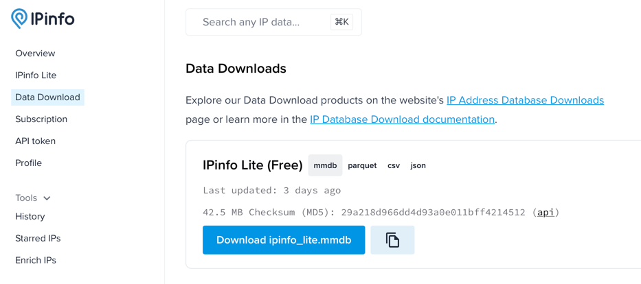

ZAnnotate
=========

ZAnnotate is a Go utility that facilitates annotating large datasets
with network metadata. Right now this includes:

 * Maxmind GeoIP2
 * AS/Routing Data (based on an MRT routing table)
 * IPInfo.io ASN and Geolocation data

For example, you can add Maxmind geolocation data to a list of IPs:

	cat ips.csv | zannotate --geoip2 --geoip2-database=geoip2.mmdb


# Installation

ZAnnotate can be installed using `make install`

```shell
make install
```

or if you don't have `make` installed, you can use the following command:

```shell
cd cmd/zannotate && go install
```

Either way, this will install the `zannotate` binary in your `$GOPATH/bin` directory.

Check that it was installed correctly with:

```shell
zannotate --version
```

# Acquiring Datasets

> [!NOTE]
> URLs and instructions may change over time. These are up-to-date as of September 2025.
Below are instructions for getting datasets from the below providers.

### IPInfo.io
IPInfo.io provides a free dataset that includes ASN and geolocation data, scoped to the country level. Paid tiers provide 
more granular geo-location data.

1. Sign up for a free account at [IPInfo.io](https://ipinfo.io/signup).
2. Navigate to the [Data Download page](https://ipinfo.io/dashboard/downloads)
3. Download the `mmdb` file

4. Example CLI usage

```shell
echo "1.1.1.1" | ./zannotate --ipinfo --ipinfo-database=./path-to-ipinfo-db.mmdb
```

```json
{"ip":"1.1.1.1","ipinfo":{"country":"Australia","country_code":"AU","continent":"Oceania","continent_code":"OC","asn":"AS13335","as_name":"Cloudflare, Inc.","as_domain":"cloudflare.com"}}
```