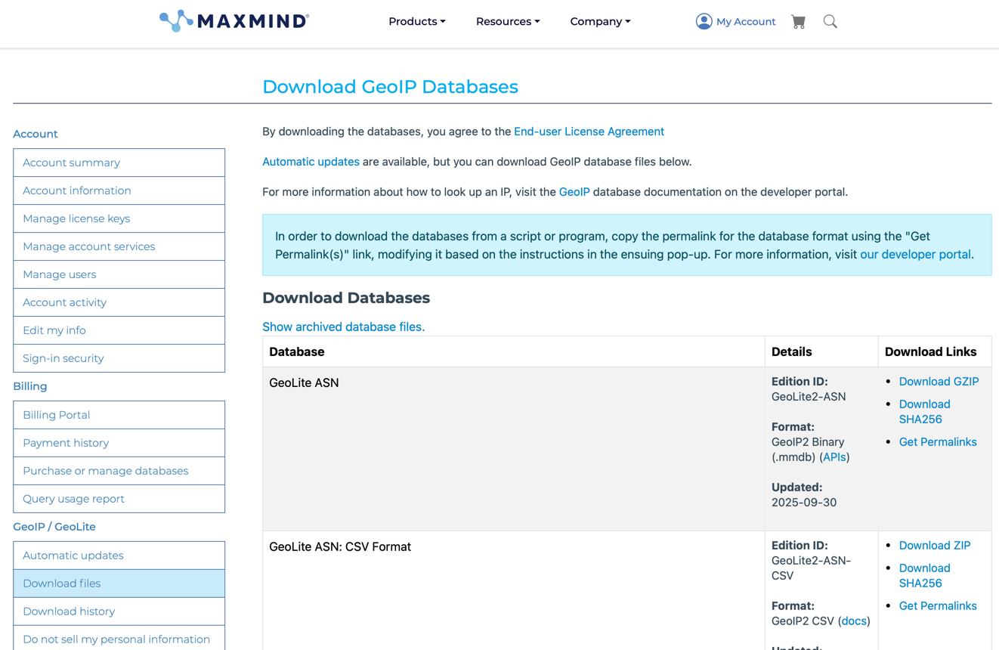

ZAnnotate
=========

ZAnnotate is a Go utility that facilitates annotating large datasets
with network metadata. Right now this includes:

 * Maxmind GeoIP2
 * AS/Routing Data (based on an MRT routing table)

For example, you can add Maxmind geolocation data to a list of IPs:

	cat ips.csv | zannotate --geoip2 --geoip2-database=geoip2.mmdb


# Installation

ZAnnotate can be installed using `make install`

```shell
make install
```

or if you don't have `make` installed, you can use the following command:

```shell
cd cmd/zannotate && go install
```

Either way, this will install the `zannotate` binary in your `$GOPATH/bin` directory.

Check that it was installed correctly with:

```shell
zannotate --help
```

# Acquiring Datasets

> [!NOTE]
> URLs and instructions may change over time. These are up-to-date as of September 2025.

Below are instructions for getting datasets from the below providers.

### GeoLite2-ASN
1. [Sign-up form](https://www.maxmind.com/en/geolite2/signup) for MaxMind GeoLite Access
2. Login to your account
3. Go to the "GeoIP / GeoLite" > "Download files" section where you should see a list of available databases
4. Download the `.mmdb` files for GeoLite ASN
5. Unzip the downloaded file and test with:

```shell
echo "1.1.1.1" | zannotate --geoasn --geoasn-database=/path-to-downloaded-file/GeoLite2-ASN_20250923/GeoLite2-ASN.mmdb
```

```shell
{"ip":"1.1.1.1","geoasn":{"asn":13335,"org":"CLOUDFLARENET"}}
```

### BGP Routing Tables
1. Go to [https://archive.routeviews.org/route-views2/bgpdata/](https://archive.routeviews.org/route-views2/bgpdata/)
2. Select a month directory (e.g. `2025.09`)
3. Select the `RIBS/` directory
4. Download a BZiped MRT file (e.g. `rib.20250923.1200.bz2`)
5. Unzip the file with:

```shell
bzip2 -d ./path-to-downloaded-file/rib.20250923.1200.bz2
```

6. Test with:

```shell
echo "1.1.1.1" | ./zannotate --routing --routing-mrt-file=/tmp/rib.20250923.1200
```

```json
{"ip":"1.1.1.1","routing":{"prefix":"1.1.1.0/24","asn":13335,"path":[3561,209,3356,13335]}}
```

# Input/Output

## Output
By default, ZAnnotate reads new-line delimited IP addresses from standard input and outputs a JSON object per line to standard output like:

```shell
echo "1.1.1.1" | zannotate --rdns --geoasn --geoasn-database=/path-to-geo-asn.mmdb
```

```json
{"ip":"1.1.1.1","geoasn":{"asn":13335,"org":"CLOUDFLARENET"},"rdns":{"domain_names":["one.one.one.one"]}}
```

If an IP address cannot be annotated, either because of an error or lack of data, there will be an empty field for that annotation.
For example, if an IP address is private and therefore has no RDNS or ASN data, the output will look like:
```shell
echo "127.0.0.1" | zannotate --rdns --geoasn --geoasn-database=/path-to-geo-asn.mmdb
```

```json
{"geoasn":{},"rdns":{},"ip":"127.0.0.1"}
```

## Input
You may wish to annotate data that is already in JSON format. You'll then need to use the `--input-file-type=json` flag.
This will insert a `zannotate` field into the existing JSON object. For example:

```shell
echo '{"ip": "1.1.1.1"}'  | ./zannotate --rdns --geoasn --geoasn-database=/path-to-geo-asn.mmdb --input-file-type=json    
```

```json
{"ip":"1.1.1.1","zannotate":{"geoasn":{"asn":13335,"org":"CLOUDFLARENET"},"rdns":{"domain_names":["one.one.one.one"]}}}
```
# Acquiring Datasets

> [!NOTE]
> URLs and instructions may change over time. These are up-to-date as of September 2025.
Below are instructions for getting datasets from the below providers.

### MaxMind GeoLite ASN and City (Formerly GeoIP2)

1. [Sign-up form](https://www.maxmind.com/en/geolite2/signup) for MaxMind GeoLite Access
2. Login to your account
3. Go to the "GeoIP / GeoLite" > "Download files" section and download the zip files for either GeoLite ASN or GeoLite City
datasets. 



4. Unzip, place the `.mmdb` files somewhere and test with the below.

#### MaxMind GeoLite City
```shell
echo "171.67.71.209" | ./zannotate --geoip2 --geoip2-database=./path-to-geolite2.mmdb
```

```json
{"ip":"171.67.71.209","geoip2":{"city":{"name":"Vallejo","id":5405380},"country":{"name":"United States","code":"US","id":6252001},"continent":{"name":"North America","code":"NA","id":6255149},"postal":{"code":"94590"},"latlong":{"accuracy_radius":50,"latitude":38.1043,"longitude":-122.2442,"metro_code":807,"time_zone":"America/Los_Angeles"},"represented_country":{},"registered_country":{"name":"United States","code":"US","id":6252001},"metadata":{}}}
```

#### MaxMind GeoLite ASN
```shell
 echo "171.67.71.209" | ./zannotate --geoasn --geoasn-database=/path-to-asn-file.mmdb 
```

```json
{"ip":"171.67.71.209","geoasn":{"asn":32,"org":"STANFORD"}}
```