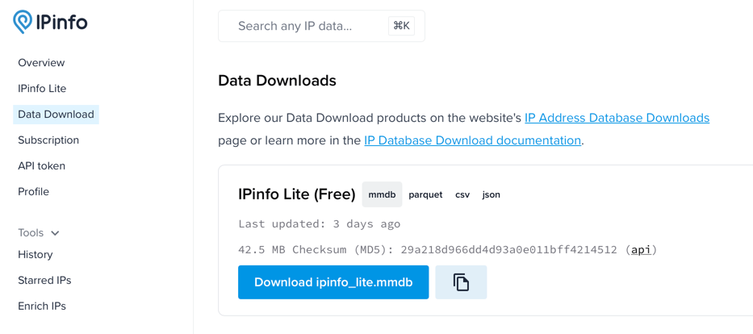

ZAnnotate
=========

ZAnnotate is a Go utility that facilitates annotating large datasets
with network metadata. Right now this includes:

 * Maxmind GeoIP2
 * AS/Routing Data (based on an MRT routing table)
 * IPInfo.io ASN and Geolocation data

For example, you can add Maxmind geolocation data to a list of IPs:

	cat ips.csv | zannotate --geoip2 --geoip2-database=geoip2.mmdb


# Installation

ZAnnotate can be installed using `make install`

```shell
make install
```

or if you don't have `make` installed, you can use the following command:

```shell
cd cmd/zannotate && go install
```

Either way, this will install the `zannotate` binary in your `$GOPATH/bin` directory.

Check that it was installed correctly with:

```shell
zannotate --help
```

# Acquiring Datasets

> [!NOTE]
> URLs and instructions may change over time. These are up-to-date as of September 2025.

Below are instructions for getting datasets from the below providers.

### GeoLite2-ASN
1. [Sign-up form](https://www.maxmind.com/en/geolite2/signup) for MaxMind GeoLite Access
2. Login to your account
3. Go to the "GeoIP / GeoLite" > "Download files" section where you should see a list of available databases
4. Download the `.mmdb` files for GeoLite ASN
5. Unzip the downloaded file and test with:

```shell
echo "1.1.1.1" | zannotate --geoasn --geoasn-database=/path-to-downloaded-file/GeoLite2-ASN_20250923/GeoLite2-ASN.mmdb
```

```shell
{"ip":"1.1.1.1","geoasn":{"asn":13335,"org":"CLOUDFLARENET"}}
```

### BGP Routing Tables
1. Go to [https://archive.routeviews.org/route-views2/bgpdata/](https://archive.routeviews.org/route-views2/bgpdata/)
2. Select a month directory (e.g. `2025.09`)
3. Select the `RIBS/` directory
4. Download a BZiped MRT file (e.g. `rib.20250923.1200.bz2`)
5. Unzip the file with:

```shell
bzip2 -d ./path-to-downloaded-file/rib.20250923.1200.bz2
```

6. Test with:

```shell
echo "1.1.1.1" | ./zannotate --routing --routing-mrt-file=/tmp/rib.20250923.1200
```

```json
{"ip":"1.1.1.1","routing":{"prefix":"1.1.1.0/24","asn":13335,"path":[3561,209,3356,13335]}}
```
### IPInfo.io
IPInfo.io provides a free dataset that includes ASN and geolocation data, scoped to the country level. Paid tiers provide
more granular geo-location data.

1. Sign up for a free account at [IPInfo.io](https://ipinfo.io/signup).
2. Navigate to the [Data Download page](https://ipinfo.io/dashboard/downloads)
3. Download the `mmdb` file
   
4. Example CLI usage

```shell
echo "1.1.1.1" | ./zannotate --ipinfo --ipinfo-database=./path-to-ipinfo-db.mmdb
```

```json
{"ip":"1.1.1.1","ipinfo":{"country":"Australia","country_code":"AU","continent":"Oceania","continent_code":"OC","asn":"AS13335","as_name":"Cloudflare, Inc.","as_domain":"cloudflare.com"}}
```

# Input/Output

## Output
By default, ZAnnotate reads new-line delimited IP addresses from standard input and outputs a JSON object per line to standard output like:

```shell
echo "1.1.1.1" | zannotate --rdns --geoasn --geoasn-database=/path-to-geo-asn.mmdb
```

```json
{"ip":"1.1.1.1","geoasn":{"asn":13335,"org":"CLOUDFLARENET"},"rdns":{"domain_names":["one.one.one.one"]}}
```

If an IP address cannot be annotated, either because of an error or lack of data, there will be an empty field for that annotation.
For example, if an IP address is private and therefore has no RDNS or ASN data, the output will look like:
```shell
echo "127.0.0.1" | zannotate --rdns --geoasn --geoasn-database=/path-to-geo-asn.mmdb
```

```json
{"geoasn":{},"rdns":{},"ip":"127.0.0.1"}
```

## Input
You may wish to annotate data that is already in JSON format. You'll then need to use the `--input-file-type=json` flag.
This will insert a `zannotate` field into the existing JSON object. For example:

```shell
echo '{"ip": "1.1.1.1"}'  | ./zannotate --rdns --geoasn --geoasn-database=/path-to-geo-asn.mmdb --input-file-type=json    
```

```json
{"ip":"1.1.1.1","zannotate":{"geoasn":{"asn":13335,"org":"CLOUDFLARENET"},"rdns":{"domain_names":["one.one.one.one"]}}}
```

# Modules

## RDAP (WHOIS successor)
RDAP (Registration Data Access Protocol) is a protocol used to access registration data for internet resources such as 
IP addresses and domain names and is the successor to WHOIS. ZAnnotate can query RDAP servers to pull registration data for IPs.

```shell
echo "1.1.1.1" | ./zannotate --rdap 
```

```json
{"ip":"1.1.1.1","whois":{"DecodeData":{},"Lang":"","Conformance":["history_version_0","nro_rdap_profile_0","cidr0","rdap_level_0"],"ObjectClassName":"ip network","Notices":[{"DecodeData":{},"Title":"Source","Type":"","Description":["Objects returned came from source","APNIC"],"Links":null},{"DecodeData":{},"Title":"Terms and Conditions","Type":"","Description":["This is the APNIC WHOIS Database query service. The objects are in RDAP format."],"Links":[{"DecodeData":{},"Value":"https://rdap.apnic.net/ip/1.1.1.1","Rel":"terms-of-service","Href":"http://www.apnic.net/db/dbcopyright.html","HrefLang":null,"Title":"","Media":"","Type":"text/html"}]},{"DecodeData":{},"Title":"Whois Inaccuracy Reporting","Type":"","Description":["If you see inaccuracies in the results, please visit: "],"Links":[{"DecodeData":{},"Value":"https://rdap.apnic.net/ip/1.1.1.1","Rel":"inaccuracy-report","Href":"https://www.apnic.net/manage-ip/using-whois/abuse-and-spamming/invalid-contact-form","HrefLang":null,"Title":"","Media":"","Type":"text/html"}]}],"Handle":"1.1.1.0 - 1.1.1.255","StartAddress":"1.1.1.0","EndAddress":"1.1.1.255","IPVersion":"v4","Name":"APNIC-LABS","Type":"ASSIGNED PORTABLE","Country":"AU","ParentHandle":"","Status":["active"],"Entities":[{"DecodeData":{},"Lang":"","Conformance":null,"ObjectClassName":"entity","Notices":null,"Handle":"IRT-APNICRANDNET-AU","VCard":{"Properties":[{"Name":"version","Parameters":{},"Type":"text","Value":"4.0"},{"Name":"fn","Parameters":{},"Type":"text","Value":"IRT-APNICRANDNET-AU"},{"Name":"kind","Parameters":{},"Type":"text","Value":"group"},{"Name":"adr","Parameters":{"label":["PO Box 3646\nSouth Brisbane, QLD 4101\nAustralia"]},"Type":"text","Value":["","","","","","",""]},{"Name":"email","Parameters":{},"Type":"text","Value":"helpdesk@apnic.net"},{"Name":"email","Parameters":{"pref":["1"]},"Type":"text","Value":"helpdesk@apnic.net"}]},"Roles":["abuse"],"PublicIDs":null,"Entities":null,"Remarks":[{"DecodeData":{},"Title":"remarks","Type":"","Description":["helpdesk@apnic.net was validated on 2021-02-09"],"Links":null}],"Links":[{"DecodeData":{},"Value":"https://rdap.apnic.net/ip/1.1.1.1","Rel":"self","Href":"https://rdap.apnic.net/entity/IRT-APNICRANDNET-AU","HrefLang":null,"Title":"","Media":"","Type":"application/rdap+json"}],"Events":[{"DecodeData":{},"Action":"registration","Actor":"","Date":"2011-04-12T17:56:54Z","Links":null},{"DecodeData":{},"Action":"last changed","Actor":"","Date":"2025-11-18T00:26:57Z","Links":null}],"AsEventActor":null,"Status":null,"Port43":"","Networks":null,"Autnums":null},{"DecodeData":{},"Lang":"","Conformance":null,"ObjectClassName":"entity","Notices":null,"Handle":"ORG-ARAD1-AP","VCard":{"Properties":[{"Name":"version","Parameters":{},"Type":"text","Value":"4.0"},{"Name":"fn","Parameters":{},"Type":"text","Value":"APNIC Research and Development"},{"Name":"kind","Parameters":{},"Type":"text","Value":"org"},{"Name":"adr","Parameters":{"label":["6 Cordelia St"]},"Type":"text","Value":["","","","","","",""]},{"Name":"tel","Parameters":{"type":["voice"]},"Type":"text","Value":"+61-7-38583100"},{"Name":"tel","Parameters":{"type":["fax"]},"Type":"text","Value":"+61-7-38583199"},{"Name":"email","Parameters":{},"Type":"text","Value":"helpdesk@apnic.net"}]},"Roles":["registrant"],"PublicIDs":null,"Entities":null,"Remarks":null,"Links":[{"DecodeData":{},"Value":"https://rdap.apnic.net/ip/1.1.1.1","Rel":"self","Href":"https://rdap.apnic.net/entity/ORG-ARAD1-AP","HrefLang":null,"Title":"","Media":"","Type":"application/rdap+json"}],"Events":[{"DecodeData":{},"Action":"registration","Actor":"","Date":"2017-08-08T23:21:55Z","Links":null},{"DecodeData":{},"Action":"last changed","Actor":"","Date":"2023-09-05T02:15:19Z","Links":null}],"AsEventActor":null,"Status":null,"Port43":"","Networks":null,"Autnums":null},{"DecodeData":{},"Lang":"","Conformance":null,"ObjectClassName":"entity","Notices":null,"Handle":"AIC3-AP","VCard":{"Properties":[{"Name":"version","Parameters":{},"Type":"text","Value":"4.0"},{"Name":"fn","Parameters":{},"Type":"text","Value":"APNICRANDNET Infrastructure Contact"},{"Name":"kind","Parameters":{},"Type":"text","Value":"group"},{"Name":"adr","Parameters":{"label":["6 Cordelia St South Brisbane QLD 4101"]},"Type":"text","Value":["","","","","","",""]},{"Name":"tel","Parameters":{"type":["voice"]},"Type":"text","Value":"+61 7 3858 3100"},{"Name":"email","Parameters":{},"Type":"text","Value":"research@apnic.net"}]},"Roles":["administrative","technical"],"PublicIDs":null,"Entities":null,"Remarks":null,"Links":[{"DecodeData":{},"Value":"https://rdap.apnic.net/ip/1.1.1.1","Rel":"self","Href":"https://rdap.apnic.net/entity/AIC3-AP","HrefLang":null,"Title":"","Media":"","Type":"application/rdap+json"}],"Events":[{"DecodeData":{},"Action":"registration","Actor":"","Date":"2023-04-26T00:42:16Z","Links":null},{"DecodeData":{},"Action":"last changed","Actor":"","Date":"2024-07-18T04:37:37Z","Links":null}],"AsEventActor":null,"Status":null,"Port43":"","Networks":null,"Autnums":null}],"Remarks":[{"DecodeData":{},"Title":"description","Type":"","Description":["APNIC and Cloudflare DNS Resolver project","Routed globally by AS13335/Cloudflare","Research prefix for APNIC Labs"],"Links":null},{"DecodeData":{},"Title":"remarks","Type":"","Description":["---------------","All Cloudflare abuse reporting can be done via","resolver-abuse@cloudflare.com","---------------"],"Links":null}],"Links":[{"DecodeData":{},"Value":"https://rdap.apnic.net/ip/1.1.1.1","Rel":"self","Href":"https://rdap.apnic.net/ip/1.1.1.0/24","HrefLang":null,"Title":"","Media":"","Type":"application/rdap+json"}],"Port43":"whois.apnic.net","Events":[{"DecodeData":{},"Action":"registration","Actor":"","Date":"2011-08-10T23:12:35Z","Links":null},{"DecodeData":{},"Action":"last changed","Actor":"","Date":"2023-04-26T22:57:58Z","Links":null}]}}
```

This should give you the same output as a direct query to an RDAP server, for example:

```shell
rdap 1.1.1.1
```
```text
IP Network:
  Handle: 1.1.1.0 - 1.1.1.255
  Start Address: 1.1.1.0
  End Address: 1.1.1.255
  IP Version: v4
  Name: APNIC-LABS
  Type: ASSIGNED PORTABLE
...<further output truncated for brevity>
```
