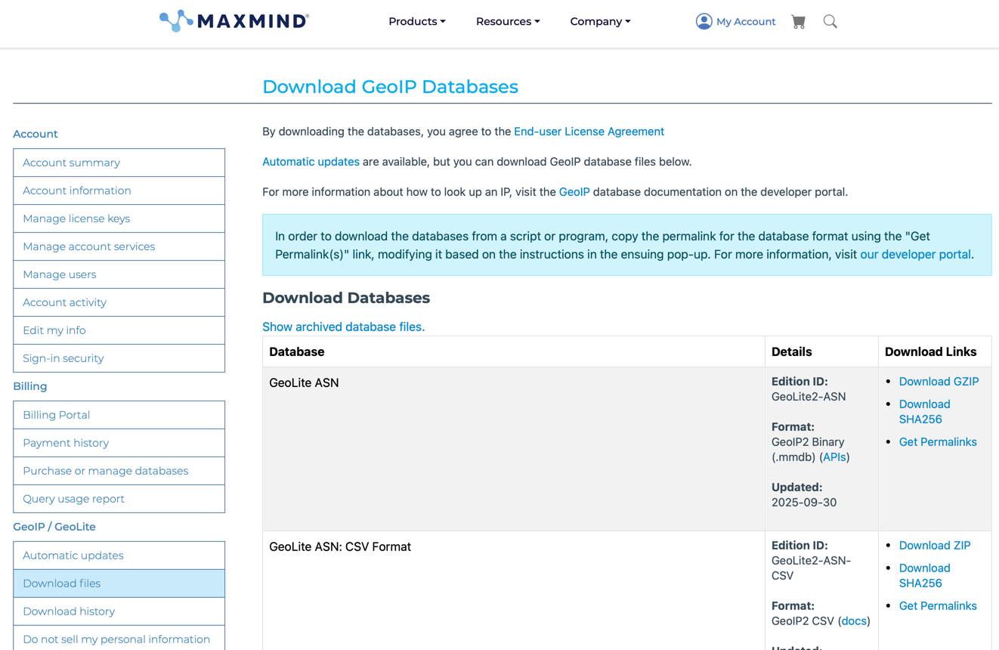

ZAnnotate
=========

ZAnnotate is a Go utility that facilitates annotating large datasets
with network metadata. Right now this includes:

 * Maxmind GeoIP2
 * AS/Routing Data (based on an MRT routing table)
 * IPInfo.io ASN and Geolocation data

For example, you can add Maxmind geolocation data to a list of IPs:

	cat ips.csv | zannotate --geoip2 --geoip2-database=geoip2.mmdb


# Installation

ZAnnotate can be installed using `make install`

```shell
make install
```

or if you don't have `make` installed, you can use the following command:

```shell
cd cmd/zannotate && go install
```

Either way, this will install the `zannotate` binary in your `$GOPATH/bin` directory.

Check that it was installed correctly with:

```shell
zannotate --help
```

# Acquiring Datasets

> [!NOTE]
> URLs and instructions may change over time. These are up-to-date as of September 2025.

Below are instructions for getting datasets from the below providers.

### MaxMind GeoIP ASN and City (Formerly GeoIP2)

MaxMind provides datasets for IP geolocation and ASN data in both a free (GeoLite) and paid (GeoIP) version.
Additionally, both the GeoLite and GeoIP datasets come in two access patterns - a downloadable database file that can be queried locally and a web API.
The GeoIP module in ZAnnotate supports the local database in both GeoLite and GeoIP versions.

The following assumes you want to use the free GeoLite datasets, but the process is similar for the paid GeoIP data.

1. [Sign-up form](https://www.maxmind.com/en/geolite2/signup) for MaxMind GeoLite Access
2. Login to your account
3. Go to the "GeoIP / GeoLite" > "Download files" section and download the zip files for either GeoLite ASN or GeoLite City
   datasets.



4. Unzip, place the `.mmdb` files somewhere and test with the below.

#### MaxMind GeoIP City
```shell
echo "171.67.71.209" | ./zannotate --geoip2 --geoip2-database=./path-to-geolite2.mmdb
```

```json
{"ip":"171.67.71.209","geoip2":{"city":{"name":"Vallejo","id":5405380},"country":{"name":"United States","code":"US","id":6252001},"continent":{"name":"North America","code":"NA","id":6255149},"postal":{"code":"94590"},"latlong":{"accuracy_radius":50,"latitude":38.1043,"longitude":-122.2442,"metro_code":807,"time_zone":"America/Los_Angeles"},"represented_country":{},"registered_country":{"name":"United States","code":"US","id":6252001},"metadata":{}}}
```

#### MaxMind GeoLite ASN
```shell
 echo "171.67.71.209" | ./zannotate --geoasn --geoasn-database=/path-to-asn-file.mmdb 
```

```json
{"ip":"171.67.71.209","geoasn":{"asn":32,"org":"STANFORD"}}
```

### BGP Routing Tables
1. Go to [https://archive.routeviews.org/route-views2/bgpdata/](https://archive.routeviews.org/route-views2/bgpdata/)
2. Select a month directory (e.g. `2025.09`)
3. Select the `RIBS/` directory
4. Download a BZiped MRT file (e.g. `rib.20250923.1200.bz2`)
5. Unzip the file with:

```shell
bzip2 -d ./path-to-downloaded-file/rib.20250923.1200.bz2
```

6. Test with:

```shell
echo "1.1.1.1" | ./zannotate --routing --routing-mrt-file=/tmp/rib.20250923.1200
```

```json
{"ip":"1.1.1.1","routing":{"prefix":"1.1.1.0/24","asn":13335,"path":[3561,209,3356,13335]}}
```
### IPInfo.io
IPInfo.io provides a free dataset that includes ASN and geolocation data, scoped to the country level. Paid tiers provide
more granular geo-location data.

1. Sign up for a free account at [IPInfo.io](https://ipinfo.io/signup).
2. Navigate to the [Data Download page](https://ipinfo.io/dashboard/downloads)
3. Download the `mmdb` file
   
4. Example CLI usage

```shell
echo "1.1.1.1" | ./zannotate --ipinfo --ipinfo-database=./path-to-ipinfo-db.mmdb
```

```json
{"ip":"1.1.1.1","ipinfo":{"country":"Australia","country_code":"AU","continent":"Oceania","continent_code":"OC","asn":"AS13335","as_name":"Cloudflare, Inc.","as_domain":"cloudflare.com"}}
```

### Spur IP Enrichment + Intelligence

[spur.us](https://spur.us/) provides per‑IP intelligence such as ASN and organization, infrastructure classification (e.g., datacenter, CDN, mobile), and geolocation metadata. 
We can query [spur.us](https://spur.us/) alongside other sources to enrich annotations and help identify datacenter/Anycast deployments, CDNs, and ISP ownership.

0. You'll need an API key from Spur to enable ZAnnotate to enrich IPs with their dataset as we'll need to make an API request for each IP address to be enriched.
Depending on current pricing, you may need to sign up for a paid account.
Check out [spur.us/pricing](https://spur.us/pricing) for more details.
1. Once you have an API key, set it as an environment variable in your current shell session:

```shell
export SPUR_API_KEY=your_api_key_here
```
(If you want to make this permanent, add the above line to your shell profile, e.g. `~/.bashrc` or `~/.zshrc`)
2. Test with:

```shell
$ echo "1.1.1.1" | ./zannotate --spur
```

Example Output:
```shell
{"ip":"1.1.1.1","spur":{"as":{"number":13335,"organization":"Cloudflare, Inc."},"infrastructure":"DATACENTER","ip":"1.1.1.1","location":{"city":"Anycast","country":"ZZ","state":"Anycast"},"organization":"Taguchi Digital Marketing System"}}
```

### Greynoise Psychic
[Greynoise](https://greynoise.io) is an IP intelligence feed that provides metadata like threat classification and associated CVE's.
Their Psychic data downloads provide their data feed in a database suitable for offline data enrichment.
To use their download with `zannotate`, you'll want to download an `.mmdb` formatted file using your GreyNoise API key. 
As of April 2026, signing up with a free account gives access to data downloads.

0. Sign up for a free GreyNoise account [here](https://www.greynoise.io).
1. Copy API key from the appropriate [section of your account](https://viz.greynoise.io/workspace/api-key).
2. Download a `mmdb` file. Details on download parameters 
(The below command is for downloading data for a single date - April 7th, 2026 - you can also download data for a range of days and for models of various levels of detail.
See GreyNoise's Psychic [documentation](https://psychic.labs.greynoise.io) for more details.
```shell
curl -H "key: GREYNOISE_API_KEY_HERE" \
           https://psychic.labs.greynoise.io/v1/psychic/download/2026-04-07/3/mmdb \
           -o /tmp/m3.mmdb
```

3. Test GreyNoise data enrichment:

> [!NOTE]
> The below examples are using the exact data download from the above `curl` command. What results you see will depend on the data downloaded.

```shell
echo "14.1.105.157" | zannotate --greynoise --greynoise-database=/tmp/m3.mmdb  
````
Example Output:
```json
{"greynoise":{"classification":"malicious","cves":["CVE-2015-2051","CVE-2016-20016","CVE-2018-10561","CVE-2018-10562","CVE-2016-6277","CVE-2024-12847"],"date":"2026-04-07","handshake_complete":true,"last_seen":"2026-04-07T00:00:00Z","seen":true,"tags":["Mirai TCP Scanner","Mirai","Telnet Protocol","Generic IoT Default Password Attempt","Web Crawler","Generic Suspicious Linux Command in Request","HNAP Crawler","Telnet Login Attempt","D-Link Devices HNAP SOAPAction Header RCE Attempt","MVPower CCTV DVR RCE CVE-2016-20016 Attempt","JAWS Webserver RCE","GPON CVE-2018-10561 Router Worm","Generic ${IFS} Use in RCE Attempt","CCTV-DVR RCE","NETGEAR Command Injection CVE-2016-6277","NETGEAR DGN setup.cgi CVE-2024-12847 Command Execution Attempt","CGI Script Scanner"],"actor":"unknown"},"ip":"14.1.105.157"}
```

Note that many IPs will not be in the GreyNoise dataset, so you may see output like the following:
```shell
echo "1.1.1.1" | zannotate --greynoise --greynoise-database=/tmp/m3.mmdb  
```

```json
{"ip":"1.1.1.1","greynoise":null}
```


# Input/Output

## Output
By default, ZAnnotate reads new-line delimited IP addresses from standard input and outputs a JSON object per line to standard output like:

```shell
echo "1.1.1.1" | zannotate --rdns --geoasn --geoasn-database=/path-to-geo-asn.mmdb
```

```json
{"ip":"1.1.1.1","geoasn":{"asn":13335,"org":"CLOUDFLARENET"},"rdns":{"domain_names":["one.one.one.one"]}}
```

If an IP address cannot be annotated, either because of an error or lack of data, there will be an empty field for that annotation.
For example, if an IP address is private and therefore has no RDNS or ASN data, the output will look like:
```shell
echo "127.0.0.1" | zannotate --rdns --geoasn --geoasn-database=/path-to-geo-asn.mmdb
```

```json
{"geoasn":{},"rdns":{},"ip":"127.0.0.1"}
```

## Input

### New-line Separated IPs
By default, ZAnnotate expects new-line delimited IP addresses on standard input. For example:
```shell
printf "1.1.1.1\n8.8.8.8" | zannotate --rdns
```

```jsonl
{"ip":"1.1.1.1","rdns":{"domain_names":["one.one.one.one"]}}
{"ip":"8.8.8.8","rdns":{"domain_names":["dns.google"]}}
```

### JSON and CSV Flags

The `--output-annotation-field` flag can be used to specify a different field name for the annotations instead of `zannotate` for both CSV and JSON. For example:

```shell
printf "name,ip_address,date\n cloudflare,1.1.1.1,04-04-26\n google,8.8.8.8,04-04-26" | ./zannotate --rdns --input-file-type=csv --input-ip-field=ip_address --output-annotation-field="info"
```

```json lines
{"name":" cloudflare","ip_address":"1.1.1.1","date":"04-04-26","info":{"rdns":{"domain_names":["one.one.one.one"]}}}
{"ip_address":"8.8.8.8","date":"04-04-26","info":{"rdns":{"domain_names":["dns.google"]}},"name":" google"}
```
### JSON
You may wish to annotate data that is already in JSON format. You'll then need to use the `--input-file-type=json` flag.
This will insert a `zannotate` field into the existing JSON object. For example:

```shell
echo '{"ip": "1.1.1.1"}'  | ./zannotate --rdns --geoasn --geoasn-database=/path-to-geo-asn.mmdb --input-file-type=json    
```

```json
{"ip":"1.1.1.1","zannotate":{"geoasn":{"asn":13335,"org":"CLOUDFLARENET"},"rdns":{"domain_names":["one.one.one.one"]}}}
```

If your JSON objects have a different field for the IP address, you can specify that with the `--input-ip-field` flag. For example, if your JSON objects have an `ip_address` field instead of `ip`, you can use:

```shell
echo '{"ip_address": "1.1.1.1"}'  | ./zannotate --rdns --input-file-type=json --input-ip-field=ip_address    
```

```json
{"ip_address":"1.1.1.1","zannotate":{"rdns":{"domain_names":["one.one.one.one"]}}}
````

### CSV
If your input data is in CSV format, you can use the `--input-file-type=csv` flag.

```shell
printf "name,ip,date\n cloudflare,1.1.1.1,04-04-26\n google,8.8.8.8,04-04-26" | ./zannotate --rdns --input-file-type=csv 
```

```jsonl
{"name":" cloudflare","ip":"1.1.1.1","date":"04-04-26","zannotate":{"rdns":{"domain_names":["one.one.one.one"]}}}
{"name":" google","ip":"8.8.8.8","date":"04-04-26","zannotate":{"rdns":{"domain_names":["dns.google"]}}}
```

Similar to JSON, you can use the `--input-ip-field` flag to specify a column other than `ip` that contains the IP address.

```shell
printf "name,ip_address,date\n cloudflare,1.1.1.1,04-04-26\n google,8.8.8.8,04-04-26" | ./zannotate --rdns --input-file-type=csv --input-ip-field=ip_address
```

```jsonl
{"date":"04-04-26","zannotate":{"rdns":{"domain_names":["dns.google"]}},"name":" google","ip_address":"8.8.8.8"}
{"date":"04-04-26","zannotate":{"rdns":{"domain_names":["one.one.one.one"]}},"name":" cloudflare","ip_address":"1.1.1.1"}
```


# Modules

## RDAP (WHOIS successor)
RDAP (Registration Data Access Protocol) is a protocol used to access registration data for internet resources such as 
IP addresses and domain names and is the successor to WHOIS. ZAnnotate can query RDAP servers to pull registration data for IPs.

```shell
echo "1.1.1.1" | ./zannotate --rdap 
```

```json
{"ip":"1.1.1.1","whois":{"DecodeData":{},"Lang":"","Conformance":["history_version_0","nro_rdap_profile_0","cidr0","rdap_level_0"],"ObjectClassName":"ip network","Notices":[{"DecodeData":{},"Title":"Source","Type":"","Description":["Objects returned came from source","APNIC"],"Links":null},{"DecodeData":{},"Title":"Terms and Conditions","Type":"","Description":["This is the APNIC WHOIS Database query service. The objects are in RDAP format."],"Links":[{"DecodeData":{},"Value":"https://rdap.apnic.net/ip/1.1.1.1","Rel":"terms-of-service","Href":"http://www.apnic.net/db/dbcopyright.html","HrefLang":null,"Title":"","Media":"","Type":"text/html"}]},{"DecodeData":{},"Title":"Whois Inaccuracy Reporting","Type":"","Description":["If you see inaccuracies in the results, please visit: "],"Links":[{"DecodeData":{},"Value":"https://rdap.apnic.net/ip/1.1.1.1","Rel":"inaccuracy-report","Href":"https://www.apnic.net/manage-ip/using-whois/abuse-and-spamming/invalid-contact-form","HrefLang":null,"Title":"","Media":"","Type":"text/html"}]}],"Handle":"1.1.1.0 - 1.1.1.255","StartAddress":"1.1.1.0","EndAddress":"1.1.1.255","IPVersion":"v4","Name":"APNIC-LABS","Type":"ASSIGNED PORTABLE","Country":"AU","ParentHandle":"","Status":["active"],"Entities":[{"DecodeData":{},"Lang":"","Conformance":null,"ObjectClassName":"entity","Notices":null,"Handle":"IRT-APNICRANDNET-AU","VCard":{"Properties":[{"Name":"version","Parameters":{},"Type":"text","Value":"4.0"},{"Name":"fn","Parameters":{},"Type":"text","Value":"IRT-APNICRANDNET-AU"},{"Name":"kind","Parameters":{},"Type":"text","Value":"group"},{"Name":"adr","Parameters":{"label":["PO Box 3646\nSouth Brisbane, QLD 4101\nAustralia"]},"Type":"text","Value":["","","","","","",""]},{"Name":"email","Parameters":{},"Type":"text","Value":"helpdesk@apnic.net"},{"Name":"email","Parameters":{"pref":["1"]},"Type":"text","Value":"helpdesk@apnic.net"}]},"Roles":["abuse"],"PublicIDs":null,"Entities":null,"Remarks":[{"DecodeData":{},"Title":"remarks","Type":"","Description":["helpdesk@apnic.net was validated on 2021-02-09"],"Links":null}],"Links":[{"DecodeData":{},"Value":"https://rdap.apnic.net/ip/1.1.1.1","Rel":"self","Href":"https://rdap.apnic.net/entity/IRT-APNICRANDNET-AU","HrefLang":null,"Title":"","Media":"","Type":"application/rdap+json"}],"Events":[{"DecodeData":{},"Action":"registration","Actor":"","Date":"2011-04-12T17:56:54Z","Links":null},{"DecodeData":{},"Action":"last changed","Actor":"","Date":"2025-11-18T00:26:57Z","Links":null}],"AsEventActor":null,"Status":null,"Port43":"","Networks":null,"Autnums":null},{"DecodeData":{},"Lang":"","Conformance":null,"ObjectClassName":"entity","Notices":null,"Handle":"ORG-ARAD1-AP","VCard":{"Properties":[{"Name":"version","Parameters":{},"Type":"text","Value":"4.0"},{"Name":"fn","Parameters":{},"Type":"text","Value":"APNIC Research and Development"},{"Name":"kind","Parameters":{},"Type":"text","Value":"org"},{"Name":"adr","Parameters":{"label":["6 Cordelia St"]},"Type":"text","Value":["","","","","","",""]},{"Name":"tel","Parameters":{"type":["voice"]},"Type":"text","Value":"+61-7-38583100"},{"Name":"tel","Parameters":{"type":["fax"]},"Type":"text","Value":"+61-7-38583199"},{"Name":"email","Parameters":{},"Type":"text","Value":"helpdesk@apnic.net"}]},"Roles":["registrant"],"PublicIDs":null,"Entities":null,"Remarks":null,"Links":[{"DecodeData":{},"Value":"https://rdap.apnic.net/ip/1.1.1.1","Rel":"self","Href":"https://rdap.apnic.net/entity/ORG-ARAD1-AP","HrefLang":null,"Title":"","Media":"","Type":"application/rdap+json"}],"Events":[{"DecodeData":{},"Action":"registration","Actor":"","Date":"2017-08-08T23:21:55Z","Links":null},{"DecodeData":{},"Action":"last changed","Actor":"","Date":"2023-09-05T02:15:19Z","Links":null}],"AsEventActor":null,"Status":null,"Port43":"","Networks":null,"Autnums":null},{"DecodeData":{},"Lang":"","Conformance":null,"ObjectClassName":"entity","Notices":null,"Handle":"AIC3-AP","VCard":{"Properties":[{"Name":"version","Parameters":{},"Type":"text","Value":"4.0"},{"Name":"fn","Parameters":{},"Type":"text","Value":"APNICRANDNET Infrastructure Contact"},{"Name":"kind","Parameters":{},"Type":"text","Value":"group"},{"Name":"adr","Parameters":{"label":["6 Cordelia St South Brisbane QLD 4101"]},"Type":"text","Value":["","","","","","",""]},{"Name":"tel","Parameters":{"type":["voice"]},"Type":"text","Value":"+61 7 3858 3100"},{"Name":"email","Parameters":{},"Type":"text","Value":"research@apnic.net"}]},"Roles":["administrative","technical"],"PublicIDs":null,"Entities":null,"Remarks":null,"Links":[{"DecodeData":{},"Value":"https://rdap.apnic.net/ip/1.1.1.1","Rel":"self","Href":"https://rdap.apnic.net/entity/AIC3-AP","HrefLang":null,"Title":"","Media":"","Type":"application/rdap+json"}],"Events":[{"DecodeData":{},"Action":"registration","Actor":"","Date":"2023-04-26T00:42:16Z","Links":null},{"DecodeData":{},"Action":"last changed","Actor":"","Date":"2024-07-18T04:37:37Z","Links":null}],"AsEventActor":null,"Status":null,"Port43":"","Networks":null,"Autnums":null}],"Remarks":[{"DecodeData":{},"Title":"description","Type":"","Description":["APNIC and Cloudflare DNS Resolver project","Routed globally by AS13335/Cloudflare","Research prefix for APNIC Labs"],"Links":null},{"DecodeData":{},"Title":"remarks","Type":"","Description":["---------------","All Cloudflare abuse reporting can be done via","resolver-abuse@cloudflare.com","---------------"],"Links":null}],"Links":[{"DecodeData":{},"Value":"https://rdap.apnic.net/ip/1.1.1.1","Rel":"self","Href":"https://rdap.apnic.net/ip/1.1.1.0/24","HrefLang":null,"Title":"","Media":"","Type":"application/rdap+json"}],"Port43":"whois.apnic.net","Events":[{"DecodeData":{},"Action":"registration","Actor":"","Date":"2011-08-10T23:12:35Z","Links":null},{"DecodeData":{},"Action":"last changed","Actor":"","Date":"2023-04-26T22:57:58Z","Links":null}]}}
```

This should give you the same output as a direct query to an RDAP server, for example:

```shell
rdap 1.1.1.1
```
```text
IP Network:
  Handle: 1.1.1.0 - 1.1.1.255
  Start Address: 1.1.1.0
  End Address: 1.1.1.255
  IP Version: v4
  Name: APNIC-LABS
  Type: ASSIGNED PORTABLE
...<further output truncated for brevity>
```
